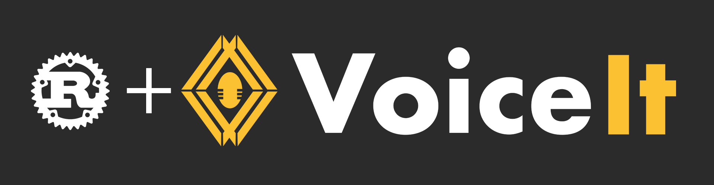

[](https://github.com/voiceittech/VoiceIt3-Rust/actions/workflows/test.yml)
[](https://github.com/voiceittech/VoiceIt3-Rust)
[](https://github.com/voiceittech/VoiceIt3-Rust/blob/main/LICENSE)
[](https://github.com/voiceittech/VoiceIt3-Rust)
[](https://voiceit.io)


A Rust wrapper for VoiceIt's API 3.0 featuring Voice + Face Verification and Identification.

## Installation

Add to your `Cargo.toml`:
```toml
[dependencies]
voiceit3 = { git = "https://github.com/voiceittech/VoiceIt3-Rust.git" }
```

## Getting Started

Sign up at [voiceit.io/pricing](https://voiceit.io/pricing) to get your API Key and Token, then log in to the [Dashboard](https://dashboard.voiceit.io) to manage your account.


## API calls
You can visit our [HTTP API 3.0 Documentation](https://voiceit.io/documentation) for detailed information on each API call.
## Support

If you find this SDK useful, please consider giving it a star on GitHub — it helps others discover the project!

[](https://github.com/voiceittech/VoiceIt3-Rust/stargazers)

## License

VoiceIt3-Rust is available under the MIT license. See the LICENSE file for more info.
